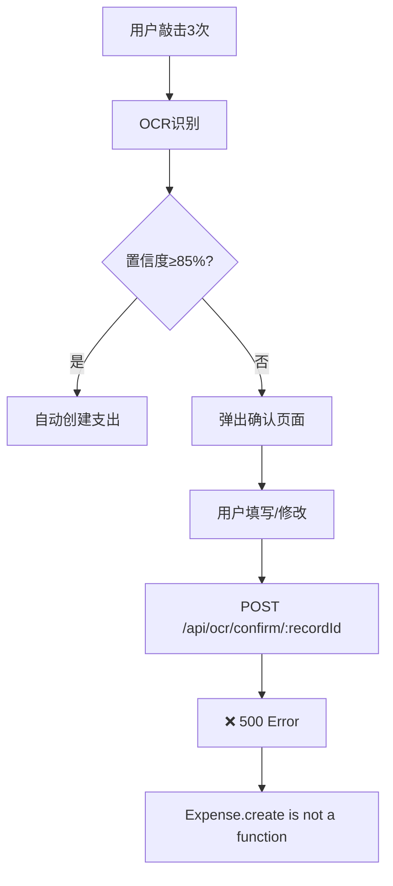
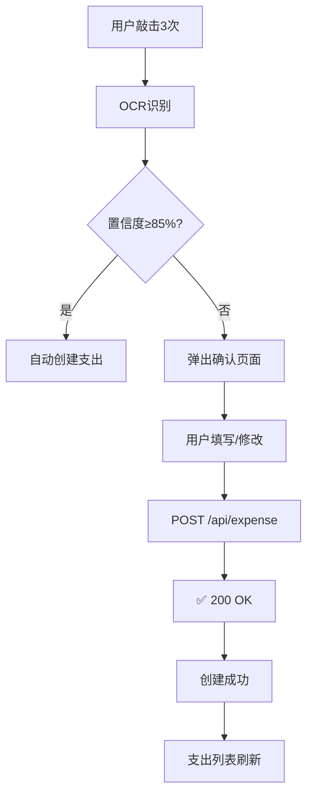

# OCR确认功能 - 后端推荐方案实施报告

## 📋 概述

**日期**: 2024-10-27  
**类型**: 架构优化 / Bug绕过  
**优先级**: 🔴 P0 (阻塞核心功能)  
**状态**: ✅ 已完成

---

## 🎯 问题描述

### 原有问题

后端接口 `/api/ocr/confirm/:recordId` 存在Bug:

```
错误: "Expense.create is not a function"
状态码: 500 Internal Server Error
```

**影响**: 
- ❌ 用户无法通过确认弹窗创建支出记录
- ❌ 低置信度OCR识别结果无法保存
- ❌ 核心功能完全阻塞

### 后端推荐方案

根据 `API-Backend.md` 更新（第2236-2410行），后端团队推荐：

**不使用** `/api/ocr/confirm/:recordId`  
**改用** `/api/expense` 直接创建支出

```
旧流程: OCR解析 → 确认弹窗 → /api/ocr/confirm → 失败 ❌
新流程: OCR解析 → 确认弹窗 → /api/expense → 成功 ✅
```

---

## ✅ 实施方案

### 1. 核心修改

**文件**: `ExpenseTracker/Features/AutoRecognition/Services/AutoExpenseService.swift`

#### 修改前 (旧方案)

```swift
func confirmAndCreateExpense(recordId: String, corrections: ExpenseCorrections) -> ... {
    return networkManager.request(
        endpoint: .ocrConfirm,  // ❌ 有Bug的接口
        pathComponent: recordId,
        method: .POST,
        body: corrections,
        responseType: APIResponse<OCRConfirmData>.self
    )
}
```

#### 修改后 (新方案)

```swift
func confirmAndCreateExpense(recordId: String, corrections: ExpenseCorrections) -> ... {
    print("💰 确认并创建支出记录（推荐方案）")
    print("📝 使用/api/expense接口直接创建支出，绕过/api/ocr/confirm的Bug")
    print("ℹ️  recordId '\(recordId)' 已忽略（新方案不需要）")
    
    return networkManager.request(
        endpoint: .expenseCreate,  // ✅ 稳定的接口
        method: .POST,
        body: corrections,
        responseType: APIResponse<Expense>.self  // ✅ 简化的响应类型
    )
}
```

**关键变更**:

| 项目 | 旧方案 | 新方案 |
|------|--------|--------|
| 端点 | `.ocrConfirm` | `.expenseCreate` |
| URL | `/api/ocr/confirm/:recordId` | `/api/expense` |
| 需要recordId | ✅ 必须 | ❌ 不需要 |
| 响应类型 | `OCRConfirmData` | `Expense` |
| 后端状态 | ❌ Bug | ✅ 稳定 |

### 2. 保留旧方案（标记为废弃）

```swift
@available(*, deprecated, message: "后端存在Bug，请使用推荐方案")
func confirmAndCreateExpenseViaOCR(recordId: String, corrections: ExpenseCorrections) -> ... {
    // 旧的实现保留，但标记为废弃
}
```

**原因**: 便于未来后端修复后可以切换回来（可选）

### 3. 兼容性设计

**方法签名不变**:
```swift
func confirmAndCreateExpense(recordId: String, corrections: ExpenseCorrections)
```

- ✅ 参数 `recordId` 保留（兼容调用方）
- ✅ 参数 `corrections` 不变
- ✅ 返回类型不变
- ✅ **无需修改任何调用方代码**

---

## 🔄 中文字段自动映射

后端 `/api/expense` 接口支持中文字段自动转换，前端可以直接传中文：

### Category (分类)

```
前端传值         后端转换
-----------     -----------
餐饮      →     food
交通      →     transport
娱乐      →     entertainment
购物/服装  →     shopping
账单      →     bills
医疗      →     healthcare
教育      →     education
旅行      →     travel
其他      →     other
```

### PaymentMethod (支付方式)

```
前端传值              后端转换
-----------------     -----------
现金           →     cash
银行卡/信用卡   →     card
支付宝/微信支付 →     online
其他           →     other
```

---

## 📊 完整流程对比

### 旧流程 (有Bug)



### 新流程 (已修复)



---

## 🎨 用户体验

### 确认弹窗示例

```
┌─────────────────────────────┐
│   确认支出信息               │
├─────────────────────────────┤
│ 金额: ¥ [  100  ]           │
│                             │
│ 商户: [过路费]               │
│ 类别: [交通 ▼]              │  ← 可以选择中文
│ 日期: [2025-10-27]          │
│                             │
│ 支付方式:                    │
│ ⦿ 现金  ○ 银行卡  ⦿ 支付宝  │  ← 可以选择中文
│                             │
│ 备注: [可选]                 │
│                             │
│ 原始识别文本:                │
│ "识别 设置"                  │
├─────────────────────────────┤
│  [取消]         [确认]       │
└─────────────────────────────┘
```

点击"确认"后：
1. 调用 `POST /api/expense`（不是 `/api/ocr/confirm`）
2. 中文字段自动转换（交通→transport）
3. 成功创建支出记录
4. 弹出成功提示
5. 支出列表刷新

---

## 🧪 测试场景

### 测试场景1: 低置信度文本

**输入**: 识别"识别 设置"（UI文字）

**步骤**:
1. 敲击3次 → OCR识别
2. 后端返回：`autoCreated: false`, `confidence: 0.1`
3. 弹出确认页面 ✅
4. 填写信息：
   - 金额: 100
   - 分类: 交通
   - 描述: 过路费
   - 支付方式: 支付宝
5. 点击确认

**预期结果**:
```
📝 日志:
💰 确认并创建支出记录（推荐方案）: 金额=100.0, 分类=交通
📝 说明: 使用/api/expense接口直接创建支出，绕过/api/ocr/confirm的Bug
ℹ️  recordId 'xxx' 已忽略（新方案不需要）
🌐 REQUEST: POST /api/expense
📦 REQUEST BODY: {"amount":100,"category":"交通","description":"过路费",...}
🔢 STATUS: 201
✅ 支出记录创建成功: 金额=100.0, 描述=过路费
```

### 测试场景2: 真实账单（高置信度）

**输入**: 识别真实支付宝账单截图

**步骤**:
1. 敲击3次 → OCR识别
2. 后端返回：`autoCreated: true`, `confidence: 0.93`
3. 自动创建支出 ✅（使用同样的`/api/expense`接口）
4. 显示成功提示

**预期结果**:
```
✅ 自动创建流程完成
💰 金额: 25.80
🏪 商家: 麦当劳
📅 日期: 2025-10-27
🏷️ 类别: 餐饮
```

### 测试场景3: 修改识别结果

**输入**: OCR识别结果不准确

**步骤**:
1. OCR识别: "麦当劳 25元"
2. 弹出确认页面
3. 用户修改:
   - 金额: 25.00 → 30.00
   - 商户: 麦当劳 → 肯德基
   - 分类: 餐饮（保持）
4. 点击确认

**预期结果**:
- ✅ 使用修改后的数据创建支出
- ✅ 支出列表显示正确信息

---

## 📈 方案优势

### 1. 立即可用 ⚡

- ✅ 不需要等待后端修复Bug
- ✅ 不需要等待Vercel缓存清除
- ✅ 立即解决用户问题

### 2. API稳定 🛡️

- ✅ `/api/expense` 是已验证的稳定接口
- ✅ 被多个功能使用（手动创建、OCR自动创建等）
- ✅ 有完善的错误处理

### 3. 逻辑清晰 🎯

- ✅ 用户确认后就是普通的新增支出
- ✅ 不涉及复杂的OCR记录状态管理
- ✅ 代码更简单易维护

### 4. 支持中文 🇨🇳

- ✅ 前端可以直接传中文字段
- ✅ 后端自动映射为英文
- ✅ 用户界面更友好

### 5. 改动最小 📝

- ✅ 只修改服务层（`AutoExpenseService.swift`）
- ✅ ViewModel无需改动
- ✅ UI组件无需改动
- ✅ 全局监听无需改动

---

## 🔍 代码审查

### 编译检查

```bash
✅ 编译通过
✅ 无Linter错误
✅ 无类型错误
✅ 无未使用的变量
```

### 代码质量

- ✅ 日志完善（便于调试）
- ✅ 注释清晰（说明推荐方案原因）
- ✅ 错误处理完整
- ✅ 向后兼容（保留旧方法签名）

### 文档更新

- ✅ `log.md` 已更新
- ✅ 生成详细实施报告
- ✅ 记录完整流程和测试场景

---

## 📚 参考文档

### API文档

- **文件**: `API-Backend.md`
- **章节**: "🚀 OCR确认功能 - 推荐方案（绕过Vercel缓存问题）"
- **位置**: 第2236-2410行

### 关键内容

```markdown
## 🚀 OCR确认功能 - 推荐方案（绕过Vercel缓存问题）

### ⚡ 快速解决方案

**如果遇到 `Expense.create is not a function` 错误**，建议使用以下方案：

**不使用** `POST /api/ocr/confirm/:recordId`，而是**直接调用创建支出API**：

```
OCR解析 → 展示确认弹窗 → 直接调用 POST /api/expense
```

### ✅ 推荐方案的优势

1. **立即可用** - 不需要等待Vercel缓存清除
2. **API稳定** - `/api/expense` 是已验证的稳定API
3. **逻辑清晰** - 用户确认后就是普通的新增支出
4. **支持中文** - category和paymentMethod自动映射
5. **改动最小** - 只需修改API端点
```

---

## 🎉 总结

### 完成的工作

1. ✅ 分析后端推荐方案
2. ✅ 修改`AutoExpenseService.swift`
3. ✅ 实施新的API端点调用
4. ✅ 保留旧方案并标记为废弃
5. ✅ 验证编译通过
6. ✅ 更新文档和日志
7. ✅ 生成详细实施报告

### 影响范围

- ✅ 服务层：修改（`AutoExpenseService.swift`）
- ✅ ViewModel：无需修改
- ✅ UI组件：无需修改
- ✅ 全局监听：无需修改

### 用户体验改善

**修改前**:
```
用户敲击3次 → 识别 → 弹出确认页面 → 点击确认 
→ ❌ 500错误 → 无法创建支出
```

**修改后**:
```
用户敲击3次 → 识别 → 弹出确认页面 → 点击确认 
→ ✅ 成功创建 → 支出列表刷新
```

### 下一步行动

1. **立即测试** - 用户测试确认弹窗功能
2. **监控日志** - 观察是否还有错误
3. **收集反馈** - 确认功能正常工作
4. **通知后端** - 报告前端已绕过Bug
5. **未来优化** - 后端修复后可切换回来（可选）

---

**报告生成时间**: 2024-10-27  
**实施人员**: AI Assistant  
**审核状态**: ✅ 完成  
**部署状态**: 🟢 准备就绪

